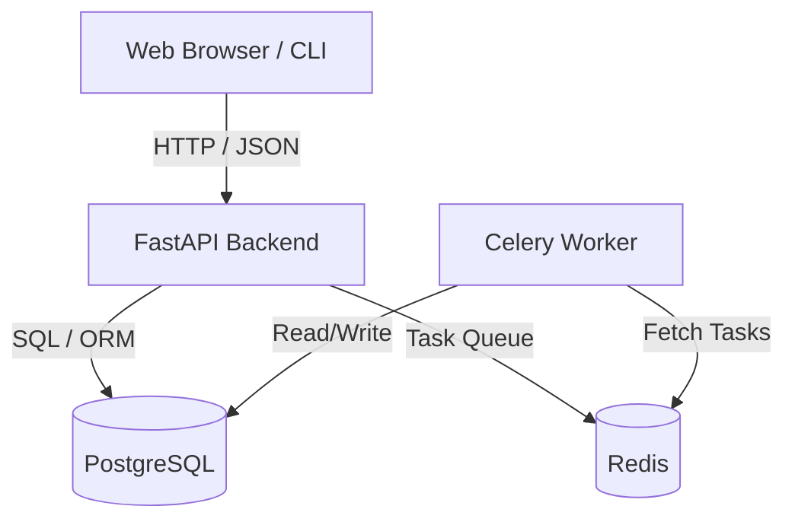

# 📚 Library Management System
A modern, production-grade **Library Management System** built with a microservice architecture. It features a high-performance Python FastAPI backend, a real-time React web application, a robust database layer (PostgreSQL & Redis), a worker architecture for background jobs (Celery), and a developer-friendly Command-Line Interface (CLI).

---

## 📖 Project Explanation & Component Breakdown

This Library Management System is built using a modern **monorepo architecture** where the frontend, backend, CLI, and database are structured to work together seamlessly. Below is an explanation of each component and how they interact:

### 1. Frontend Client (React & Vite)
*   **Role**: The client-side web application interface.
*   **Technology**: React 19, Vite (as the build tool/bundler), Zustand (for lightweight and predictable global state management), and Lucide React (for UI iconography).
*   **Purpose**: Provides an interactive dashboard for users and librarians. It consumes the FastAPI JSON endpoints to authenticate users, search/filter the catalog, check membership status, and manage book borrowings.

### 2. Backend Server (FastAPI)
*   **Role**: The central coordinator and data provider.
*   **Technology**: FastAPI (Python 3.12), SQLAlchemy (Object Relational Mapper), and Pydantic v2 (data modeling and validation).
*   **Purpose**: Exposes a secure, high-performance RESTful API. It processes incoming requests from the React frontend and CLI client, handles user authentication/authorization (JWT tokens via `python-jose`), performs business logic validations, and executes transactions on the database.

### 3. Database Layer (PostgreSQL & Alembic)
*   **Role**: Persistent relational data storage.
*   **Technology**: PostgreSQL 15.
*   **Purpose**: Stores structured records for books, users, library members, and active/completed loans. 
*   **Migrations**: **Alembic** manages version-controlled schema changes, allowing developers to upgrade or downgrade the database layout predictably as features are added.

### 4. Background Processing Queue (Redis & Celery)
*   **Role**: Asynchronous job worker system.
*   **Technology**: Redis 7 (Broker) and Celery (Worker).
*   **Purpose**: Handles long-running or resource-intensive tasks off the main thread so that backend API responses remain lightning-fast. For example, sending overdue book reminder emails, computing catalog statistics, or running bulk imports occurs asynchronously inside the Celery worker container.

### 5. Command Line Interface (CLI)
*   **Role**: A lightweight command-line administrative client.
*   **Technology**: Click (Python CLI framework) and Tabulate.
*   **Purpose**: Allows developers and administrators to bypass the browser and run database commands directly from the terminal (e.g. adding new books, listing members, or testing loan operations).

### 6. Containerization & CI/CD
*   **Role**: Standardized environments and automated deployment.
*   **Technology**: Docker, Docker Compose, and GitHub Actions.
*   **Purpose**: Multi-stage Dockerfiles guarantee identical environments in development and production. The GitHub Actions workflow automates code style checks (Ruff), runs testing suites (pytest), builds the frontend, and publishes production-ready containers to the GitHub Container Registry.

---

## 🎯 Project Development Milestones

This repository houses a complete, multi-tiered Library Management System built and tested across two main development phases:

### 📅 Technical Milestones

#### Phase 1: CLI System, Database & Container Foundations
*   **Git & CI/CD Foundations**: Repository initialized with branch protection rules and a GitHub Actions workflow to run code linting (Ruff) and unit tests (pytest) on every PR.
*   **Docker & Containerization**: Multi-container setup orchestrating the application services alongside a persistent PostgreSQL database.
*   **Databases & ORM Integration**: Relational database schema (Books, Members, Loans) defined and managed via Alembic migrations, with database access wired to the CLI via the SQLAlchemy ORM.
*   **CLI Application**: A terminal-based interface supporting full catalog searches, member registration, and book borrowing/return flows.

#### Phase 2: REST API, Authentication, Background Queue & Web UI
*   **FastAPI REST Backend**: High-performance HTTP server exposing structured CRUD endpoints for all library models, complete with auto-generated OpenAPI (`/docs`) docs.
*   **Authentication & Role Authorization**: Secure signup/login system utilizing JWT tokens with role-based access controls (differentiating between Members and Librarians).
*   **Background Worker System**: Real-time caching and background tasks powered by Celery and Redis (supporting asynchronous actions triggered by API events).
*   **React Frontend Client**: Single-page browser interface built using React 19 and Vite, fully integrated with the FastAPI backend endpoints and JWT session state.
---


## 🛠️ Architecture & Technology Stack

The application is split into specialized layers inside a monorepo setup:



---

## 🚀 How to Run the Project

You can run this project in two ways: using **Docker Compose** (recommended for quick setup) or by **running components locally** (recommended for active development).

### Method 1: Running with Docker Compose (Quick Setup)

This is the easiest way to launch the entire stack (Database, Redis, Backend API, Celery Worker, and Frontend).

1.  **Prerequisites**: Ensure you have [Docker Desktop](https://www.docker.com/products/docker-desktop/) installed and running.
2.  **Start Services**: Run the following command in the root folder of the project:
    ```bash
    docker-compose up --build
    ```
3.  **Access the Applications**:
    *   **Frontend Client**: [http://localhost:3000](http://localhost:3000)
    *   **Backend REST API**: [http://localhost:8000](http://localhost:8000)
    *   **Interactive API Docs (Swagger UI)**: [http://localhost:8000/docs](http://localhost:8000/docs)

---

### Method 2: Running Locally (Manual Setup)

Use this method if you plan to write code and want fast live-reloads without rebuilding containers.

#### 1. Setup Backend Dependencies & Migrations
Ensure you have **Python 3.12+** and [Astral uv](https://github.com/astral-sh/uv) installed. Make sure you also have a PostgreSQL server running locally.

```bash
# Sync python dependencies and create virtual environment
uv sync --dev

# Run database migrations to set up tables
uv run alembic upgrade head

# Start the FastAPI development server
uv run uvicorn backend.app.main:app --reload --port 8000
```

#### 2. Start Celery & Redis (For Background Jobs)
Ensure Redis is running locally on port `6379`.
```bash
uv run celery -A backend.workers.celery_app worker --loglevel=info
```

#### 3. Run the React Frontend
Ensure you have **Node.js** installed.
```bash
cd frontend
npm install
npm run dev
```
Open [http://localhost:5173](http://localhost:5173) in your browser.

---

## 💻 Command Line Interface (CLI)

The custom administrative CLI allows you to execute operations directly on the library database (e.g. managing books, loans, members, and system users).

Run the CLI using `uv`:
```bash
# View all available CLI commands
uv run python cli/src/main.py --help
```

---

## 🛡️ CI/CD Pipeline Configuration

Our **GitHub Actions Pipeline** (.github/workflows/ci-cd.yml) executes automatically on every `push` or `pull_request` to `main` and `staging` branches:

1.  **Code Check**: Checks dependency compatibility with `uv sync`.
2.  **Lint Verification**: Runs `ruff check` validation.
3.  **Unit Tests**: Runs tests across backend components and CLI suites.
4.  **Frontend Builder**: Validates and builds the React frontend production package.
5.  **Docker Deployments**: Builds production Docker images and publishes them automatically to the **GitHub Container Registry (GHCR)**.

---

## 📄 License
This project is licensed under the MIT License - see the LICENSE file for details.
